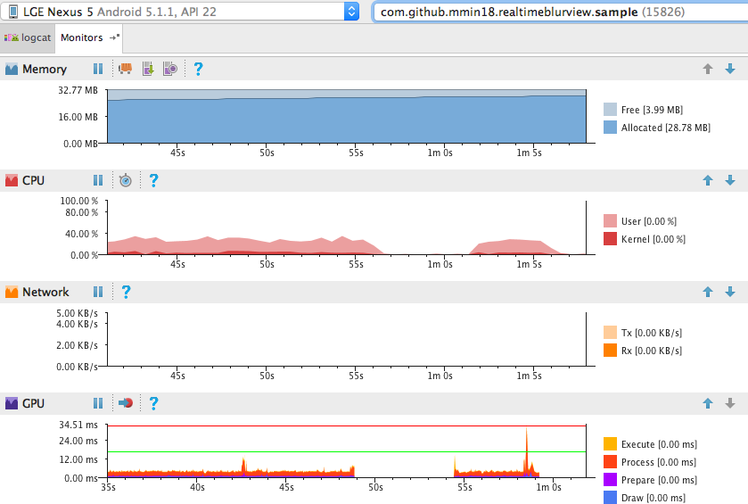

<p align="center">
  
</p>
<div align="center">
  <a href="https://github.com/HardcodedCat/RealtimeBlurView_v2/actions/workflows/sample_build.yml?query=branch%3Amaster">
    
  </a>
</div>
<br />
<div align="center">
  <a href="https://developer.android.com/about/versions/android-4.0-highlights">
    
  </a>
  <a href="https://github.com/HardcodedCat/RealtimeBlurView_v2/commits/master">
    
  </a>
  <a href="https://github.com/HardcodedCat/RealtimeBlurView_v2/releases">
    
  </a>
  <a href="/LICENSE">
    
  </a>
</div>
<br />


[RealtimeBlurView_v2](https://github.com/HardcodedCat/RealtimeBlurView_v2) is a unofficial, modified fork of [RealtimeBlurView](https://github.com/mmin18/RealtimeBlurView), an realtime blurring overlay lib for Android (like iOS UIVisualEffectView).

***

Just put the view in the layout xml, no Java code is required.

	// Views to be blurred
	<ImageView ../>
	
	<com.github.mmin18.widget.RealtimeBlurView
		android:layout_width="match_parent"
		android:layout_height="match_parent"
		app:realtimeBlurRadius="20dp"
		app:realtimeOverlayColor="#8000" />
	
	// Views above blurring overlay
	<Button ../>

Try the sample apk: [blurring.apk](https://github.com/HardcodedCat/RealtimeBlurView_v2/suites/9075384565/artifacts/420105390)

***

# Adding to project

Add dependencies in your `build.gradle`:

```groovy
	dependencies {
	    implementation 'com.github.HardcodedCat:RealtimeBlurView_v2:1.3.2'
	}
```

## Support API level < 19

The following step is only required if your minSdkVersion < 19, or you use renderscript support mode.

Both AndroidX and Android Support Library is supported.

```groovy
	android {
		buildToolsVersion '30.0.3'                 // Use 23.0.3 or higher
		defaultConfig {
			minSdkVersion 15
			renderscriptTargetApi 19
			renderscriptSupportModeEnabled true    // Enable RS support
		}
	}
```

Add proguard rules if necessary:

```
-keep class android.support.v8.renderscript.** { *; }
-keep class androidx.renderscript.** { *; }
```

***

# Limitations

- Adding multiple RealtimeBlurView (even not visible) may hurt drawing performance, like use it in ListView or RecyclerView.

- It will not work with SurfaceView / TextureView like VideoView, GoogleMapView

***

# Performance

RealtimeBlurView use RenderScript to blur the bitmap, just like [500px-android-blur](https://github.com/500px/500px-android-blur).

Everytime your window draw, it will render a blurred bitmap, so there is a performance cost. Set downsampleFactor>=4 will significantly reduce the render cost. However, if you just want to blur a static view, 500px-android-blur is good enough.

I've run the sample on some old phones like Samsung Galaxy S2, Samsung Galaxy S3, it runs at full FPS. Here is a performance chart while scrolling the list on Nexus 5.



***

# Changelog
>
> **1.3.2 (2022-11-28)**
>
> Optimizations and other features
>
> **1.3.0 (2020-04-27)**
>
> Support for circle shape blur
>
> **1.2.1 (2019-05-24)**
>
> Improve BlurImpl detection.
>
> **1.2 (2019-05-22)**
>
> Support both AndroidX and Android Support Library.
>
> **1.1.2 (2018-05-28)**
>
> Bug fix (Draw overlay color in rect).
>
> **1.1.1 (2018-05-22)**
>
> Fix downsample factor issue when blur radius is very big.
>
> **1.1.0 (2017-01-02)**
> 
> Some improvements (OOM, resize, window background)
>
> **1.0.8 (2016-11-29)**
> 
> Fix view not refreshed issue on PopupWindow
> 
> **1.0.6 (2016-11-7)**
> 
> Fix crash when view is very small (draw at least 1px)
>
> **1.0.5 (2016-11-5)**
>
> Support Popup Window (Use it as dialog background)
> Ignore UnsatisfiedLinkError if APK is not debuggable.
> 
> **1.0.4 (2016-9-28)**
>
> Support custom shape (by override drawBlurredBitmap()), support view in ContextThemeWrapper.
